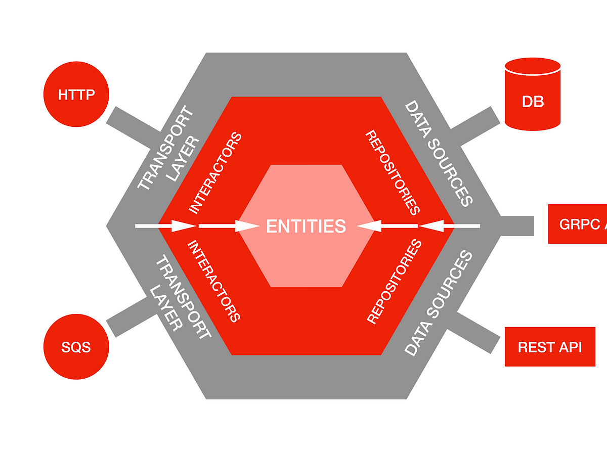

# Introduction 
This repository is a demo for the DevSquad team interview. The requirement was to create a Web service using C# to consult repositories (with different technologies) to allow the test and deployment in a Cloud env.

# Sample High Level Architecture
In this demonstration, I've opted for the hexagonal architecture, also known as the ports and adapters architecture. This architectural pattern finds application in software design. 

Its objective is to establish loosely interconnected components within an application, allowing seamless linkage to the software ecosystem through ports and adapters. This approach enables the interchangeability of components across various levels and simplifies the implementation of automated testing.

Below you can find an idea of the architecture approach:

# Getting Started

In order to run this project you will need to install:

1.	Visual Studio 2022 (Community version can be used as well) (https://visualstudio.microsoft.com/downloads/)
2.	.NET 7 Run time and SDK (https://dotnet.microsoft.com/en-us/download/dotnet/7.0)
3.	Docker - not mandatory (https://www.docker.com/)

# Build and Test
To build and test, restore all references and run the "DevSquad.Services.API" project under "Services" folder.

# Test
To test, take advantage of the "DevSquad.Tests" project which runs using nUnit and you'll find some sample entities, fakes and integration tests.
